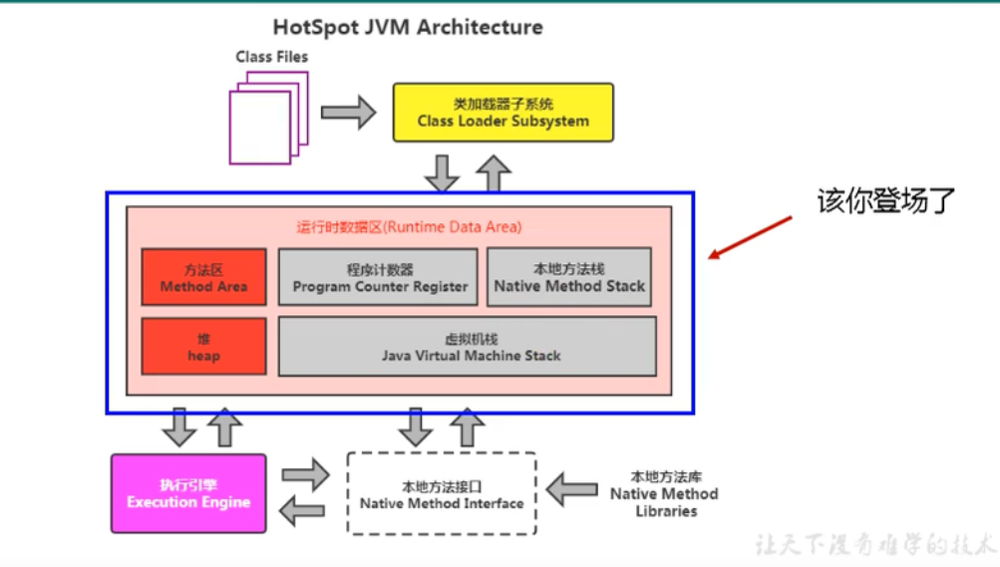
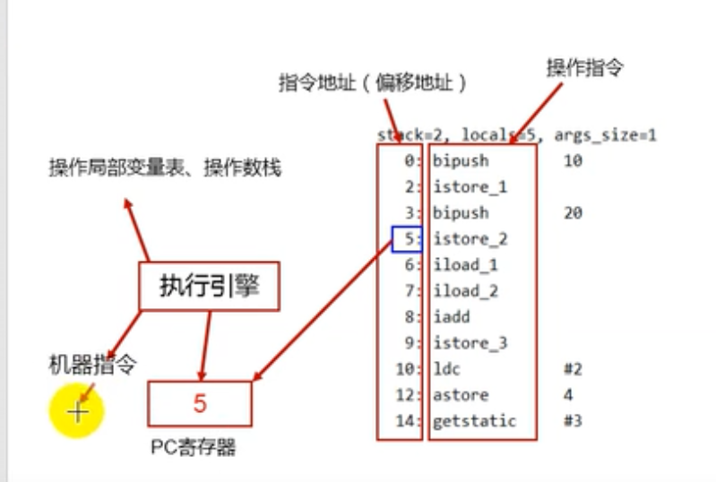
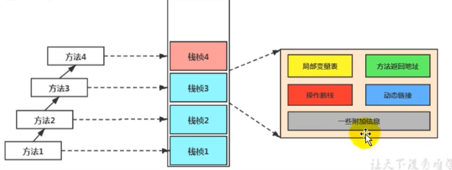
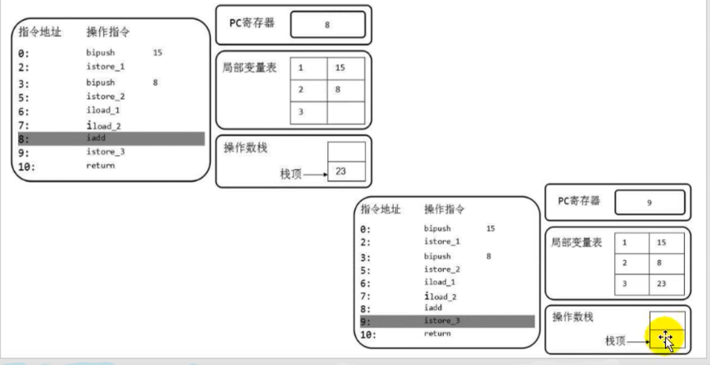

1.JVM概述

2.类加载子系统

3--10：运行时数据区

11：执行引擎：及时编译器垃圾回收

12：String的使用

13--16:关于垃圾回收

​	如何判断是否是垃圾


# 1.JVM与java体系结构

编写java程序---> 生成字节码文件----->可以在不同的操作系统中运行（不同系统运行着不同类型的JVM）


JVM用于解释字节码文件

字节码：平时说的字节码是由java程序编译过来的


## 虚拟机与虚拟机介绍


**虚拟机：**

​	虚拟机又分位程序虚拟机和系统虚拟机

- ​	visual box和VMWare属于系统虚拟机
- ​	程序虚拟机的代表就是Java虚拟机

**Java虚拟机**

- java虚拟机是一台执行Java字节码的虚拟计算机，他拥有独立的运行机制，其运行的Java字节码也未必由Java语言编译而成
- JVM平台的各种语言可以共享Java虚拟机带来的跨平台性、优秀的垃圾回收器，以及可靠的即时编译器。
- Java技术的核心就是Java虚拟机，因为所有的Java程序都运行在Java虚拟机内部

**Java虚拟机作用：**

- Java虚拟机就是二进制字节码的运行环境，负责装载字节码到其内部，解释/编译为对应平台上的机器指令。每一条Java指令，java虚拟机中都有响应定义，如怎样取操作数，怎样处理操作数，处理结果放到哪。

**Java虚拟机特点**

- 一次编译，到处运行
- 自动内存管理
- 自动垃圾回收功能

## JVM的位置

用户程序（.class 文件）——》（通过编译编译成）二进制字节码--》JVM


## JVM的整体结构

HotSpot虚拟机是目前市面上高性能虚拟机的代表作之一

它采用解释器与即时编译器并存的架构

结构为：

class file--》类加载子系统--》运行时数据区（方法区、堆、java栈、本地方法栈、程序计数器）--》执行引擎、本地方法结构、本地方法库

## JVM的架构模型

有栈、寄存器两种架构模型：

由于跨平台性的设计，java的指令都是根据栈来设计的。不同平台CPU架构不同，所以不能设计为基于寄存器的。优点是跨平台，指令集小，编译器容易实现，缺点是性能下降，实现同样的功能需要更多的指令。

栈：抗压平台性、指令集小、指令多；执行性能比寄存器差

## JVM的生命周期

**java虚拟机的启动**

​	Java虚拟机的启动是通过引导类加载器创建一个初始类来完成，这个类是由虚拟机的具体实现指定的。

**虚拟机的执行**

- 一个运行的java虚拟机有着清晰地任务：执行java程序
- 程序开始执行时他才运行，程序结束时他就停止
- 执行一个所谓的Java程序的时候，真真正正在执行的是一个叫做Java虚拟机的进程

**虚拟机的退出：**

分为几种情况：

正常执行结束

程序在执行过程中遇到了异常或错误而异常终止

由于操作系统出现错误而导致java虚拟机进程终止

某线程调用Runtime类或System类的exit方法，或Runtime类的halt方法并且Java安全管理器也允许这次exit或halt操作


# 2. 类加载子系统

## 类加载机制概述

- **描述：**虚拟机把描述类的数据从Class文件加载到内存，并对数据进行校验和初始化，最终形成可以被虚拟机直接使用的Java类型，这就是虚拟机的类加载机制。

- 懒加载：使用的时候才去进行加载。不用的时候不进行加载

**类的加载过程**：加载---》链接（验证--》准备---》解析）---》初始化

## 1）加载（Loading）

1. 通过一个类的权限定名获取定义此类的二进制字节流
2. 将这个字节流所代表的静态存储结构转换为方法区的运行时数据结构
3. 在内存中生成一个代表这个类的java.lang.Class对象，作为方法区这个类的各种数据的访问入口

## 2）链接（linking）

### 验证（Verify）

目的在于确保Class文件的字节流中包含信息符合当前虚拟机要求，保证加载类的正确性，不会威胁虚拟机自身安全

### 准备(Prepare)

- 为类变量分配内存并且设置该变量的默认初始值，即零值。
- 这里不包含用final修饰的static，因为final在编译的时候就会分配了，准备阶段会显示初始化
- 这里不会为实例变量分配初始化，变量会分配在方法区中，而实例变量是会随着对象一起分配到java堆中

### 解析(Resolve)

将常量池中的符号引用转换为直接过程

## 3）初始化

初始化阶段就是执行类构造方法<clinit>的过程。

此方法不需要定义，是javac编译器自动收集类中的所有类变量的复制动作和静态代码块中的语句合并而来。

**初始化的时机：**

- 遇到new、getstatic、putstatic或invokestatic这4条字节码指令时如果类没有进行过初始化，则需要先触发其初始化。
- 使用Java.lang.reflect包的方法对类进行反射调用的时候，如果类没有进行过初始化，则需要先触发其初始化
- 当初始化一个类的时候，如果发现其父类还没有进行过初始化，则需要先触发其父类的初始化
- 当虚拟机启动时，用户需要制定一个要执行的主类（包含main（）方法的那个类），虚拟机会先初始化这个主类。

**不会被初始化的例子：**

- 通过子类引用父类的静态字段，子类不会被初始化。
- 通过数组定义来引用的类不会被初始化。
- 调用类的常量，被调用的类不会被初始化。

## 4）加载器的分类

**虚拟机自带的加载器**:

- 启动类加载器（引导类加载器，BootStrap ClassLoader)

  加载java的核心类库，用c/c++编写。获取不到

- 扩展类加载器（Extension ClassLoader）

  加载特定类库下的class文件，java语言编写。

- 应用类加载器（系统类加载器，AppClassLoader)

**用户自定义类加载器：**

日常开发过程中上述三种系统提供的类加载器其安全够用。必要时需要自定义类加载器，来定制类的加载方式。

为什么要用自定义类加载器：

- 隔离加载类
- 修改类加载的方式
- 扩展加载源
- 防止源代码泄露

### classerLoader

ClassLoader类，他是一个抽象类，其后所有的类加载器都继承子ClassLoader（不包括启动类加载器）

方法名称：

- getParent（）	返回该加载器的超类加载器
- loadClass(String name)
- findClass(String name)
- findLoadedClass(String name)
- defineClass(String name, byte[] b,int off, int len)
- resolveClass(Class<?> c)

## 5）双亲委派机制

Java虚拟机对class文件采用的是**按需加载**的方式，也就是说当需要使用该类是才会将它的class文件加载到内存生成class对象。而且加在某个类文件时，java虚拟机采用的是**双亲委派模式**，即吧请求交由父类处理，它是一种任务委派模式。

### 工作原理

1. 如果一个类加载器收到了类加载请求，他不会自己先去加载，而是把这个请求委托给父类加载器去执行；
2. 如果父类加载器还存在父类，则进一步向上委托，直到顶层的启动类加载器；
3. 如果父类加载器可以完成了类加载任务，返回成功。否则子加载器才会尝试自己去加载

### 优势

1. 避免类的重复加载
2. 保护程序安全，防止核心API被随意篡改

## 6）沙箱安全机制

自定义String类，但是在加载String类的时候会率先使用引导类加载器加载，而引导类加载器在加载过程中会先加载jdk自带的文件（rt.jar包中java\lang\String.class），报错信息说没有main方法，就是因为加载的是rt.jar包中的String类。这样保证对Java核心源代码的保护，这就是**沙箱安全机制**。

## 7）其他

JVM中标识两个class对象是否为同一个类存在两个必要条件：

- 类的完整类名必须一致包括包名
- 加载类的ClassLoader必须相同

**类的主动使用和被动使用：**

java程序对类的使用方式分为：主动使用和被动使用

主动使用又分为七种情况

1. 创建类的实例

2. 访问某个类或接口的静态变量赋值

3. 调用类的静态方法

4. 反射（比如：Class.forName（“leiming”）)

5. 初始化一个类的子类

6. java虚拟机启动时被标明为启动类的类

7. jdk7开始提供的动态语言支持


除以上其中情况外，其他使用java类的情况都被看作是类的被动使用，**都不会导致类的初始化**

# 3.运行时数据区概念及线程



## 概述

class文件通过类加载器（加载->链接->初始化），将类加载到方法区

每个线程：独立包括程序计数器、本地方发展、虚拟机栈

线程间共享：堆、堆外内存（永久代或元空间代码缓存）

## 线程

- 线程是一个程序里的运行单元。JVM允许一个应用有多个线程并发执行
- 在Hotspot JVM里，每个线程都与操作系统的本地线程直接映射。
  - 当一个java线程准备好执行以后，此时一个操作系统的本地线程也同时创建。java线程执行终止后，本地线程也会回收。
- 操作系统负责所有的线程安排调度到任何一个可用的CPU上。一旦本地线程初始化成功，就会调用java线程中的run（）方法。

线程分为：守护线程、普通线程

在后台会有许多线程在运行，这些线程不包括用户创建的线程。

这些主要的后台系统线程在Hotspot JVM里主要是以下几个：

- 虚拟机线程
- 周期任务线程
- GC线程
- 编译线程
- 信号调度线程

# 4. 程序计数器（PC寄存器）

## 1）PC Register介绍

JVm中的程序计数寄存器（Program Counter Register）中，Register的命名源于CPU的寄存器，寄存器存储指令相关的现场信息。CPU只有把数据庄仔倒寄存器才能够运行。

这里并非指广义上的物理寄存器，或许将其翻译为PC计数器（或指令计数器）会更贴切。**JVM中的PC寄存器是对物理PC寄存器的一种抽象模拟。**

**作用：**

1. PC寄存器用于存储指向下一条指令的地址，也即将要执行的指令代码。由执行引擎读取下一条指令。
2. 它是一块很小的内存空间，几乎可以忽略不计。也是运行速度最快的存储区域。
3. 在JVM规范中，每一个线程都有它自己的程序计数器，是线程私有的，生命周期和线程保持一致。
4. 任何时间一个线程都只有一个方法在执行，也就是所谓的当前方法。程序计数器会存储当前线程正在执行的java方法deJVM指令地址；或者，如果是执行native方法，则是未指定值（undefined）。
5. 他是程序控制流的指示器，分支、循环、跳转、异常处理、线程恢复等基础功能都需要依赖这个计数器。
6. 字节码解释器工作时就是通过改变计数器的值来选取下一个需要执行的字节码执行。
7. 他是唯一一个在Java虚拟机规范中没有规定任务OutMomeryError情况的区域


## 2） 举例说明




## 3） 两个常见问题

**使用PC寄存器存储字节码指令地址有什么用呢，为什么要使用PC寄存器记录对当前线程的执行地址呢？**

- 因为CPU需要不停地切换各个线程，这时候切换回来以后，就得直到接着从哪里开始继续执行。
- JVM的字节码解释器就需要通过改变PC寄存器的值来明确下一条应该执行什么样的字节码指令。

**PC寄存器为什么会设定为线程私有？**

为了能够准确地记录各个线程正在执行的当前字节码指令地址，最好的办法自然是为每一个线程都分配一个PC寄存器。


# 5. 虚拟机栈


## 1）虚拟机栈概述

虚拟机栈：优点是跨平台，指令集小，编译器容易实现，缺点是性能下降，实现同样的功能需要更多的指令

栈是运行时的单位，而堆是存储的单位。

即：栈解决程序的运行问题，即程序如何执行，或者说如何处理数据。堆解决的是数据存储的问题，数据怎么放、放在哪。

- **JAVA虚拟机栈是什么？**

  java虚拟机栈早期也叫Java栈。**每个线程在创建时都会创建一个虚拟机栈，**其内部保存一个个的栈帧（Stack Frame），对应着一次次的Java方法调用。**是线程私有的**

- **生命周期**

  生命周期和线程一致。

- **作用**

  主观Java程序的运行，它保存方法的局部变量（8种基本数据类型、对象的引用地址）、部分结果，并参与方法的调用和返回。

  1. 局部变量VS成员变量（或属性）
  2. 基本数据变量VS引用类型变量（类数组接口)

- **栈的优点**

  - 栈是一种快速有效的分配存储方式，访问速度仅次于程序计数器
  - JVM直接对Java的操作只有两个：
    - 每个方法执行，伴随着进栈（入栈、压栈）
    - 执行结束后的出栈工作
  - 对于栈来说不存在垃圾回收
    - 不需要GC，但是会有OOM（内存溢出异常），因为有可能溢出（寄存器既没有垃圾回收也没有异常）

- **面试题：开发中遇到过的异常有哪些**

  **虚拟机规范允许Java栈的大小是动态的或者是固定不变的**

  - 如果用固定大小的Java栈，如果线程请求分配的栈容量超过Java虚拟机栈允许的最大容量，Java虚拟机会跑出Stack OverflowError异常
  - 如果用动态扩栈的Java栈，在扩栈时无法申请到足够的内存，或者创建新的线程时没有足够的内存去创建对应的虚拟机栈，则会抛出outOfMemoryError异常

  

## 2）栈的存储单位

1. **栈存储什么？**

   - 每个线程都有自己的栈，栈中的数据是以栈帧（Stack Fram）的格式存在的。
   - 在这个线程上执行的每一个方法都一一对应各自的唯一一个栈帧。
   - 栈帧是一个内存区块，是一个数据集，维系着方法执行过程中用到的各种信息

2. **栈的运行原理**

   - JVM对java栈的操作只有两个：压栈和出栈
   - 一条活动线程中，一个时间点上，只会有一个活动的栈帧，即只有当前执行方法的栈帧（栈顶栈帧）是有效的，此栈帧被称为当前栈帧（Current Frame），与之对应的方法就是当前方法（）Current Method），定义这个方法的类就是当前类（CurrentClass）
   - 执行引擎运行的所有字节码指令只针对当前栈帧进行操作。
   - 如果在该方法中调用了其他方法，对应的新栈帧会被创建出来放在栈顶，成为新的当前帧
   - 不同线程之间的栈帧是不允许互相引用的。
   - 如果当前方法调用了其他方法，方法返回时，当前栈帧会将返回结果返回给上一个栈帧，接着虚拟机丢弃当前栈帧。
   - Java方法有两种返回函数的方式，一种是正常函数的返回即return方式；另一种是抛出异常。不管哪种方式，都会导致栈帧被弹出。

3. **栈帧的内部结构**

   - **局部变量表（Local Variables）**

   - **操作数栈（Operand Stack）（或表达式栈）**

   - 动态链接（Dynamic Linking）（或指向运行时常量池的方法引用）

   - 方法返回地址（Return Address）（或方法正常退出或异常退出的定义）

   - 一些附加信息

     


## 3）局部变量表

- 局部变量表也被称为局部变量数组或本地变量表
- 定**义为一个数字数组，主要用于存储方法参数和定义在方法体内的局部变量**，这些数据类型包括基本数据类型、对象引用（reference），以及returnAddress类型。
- 由于局部变量表示线程私有的所以**不存在线程安全问题**
- **局部变量表的容量大小是在编译期定下来的**，并保存在方法的Code属性的maximum local variables数据项中。**在方法运行期间是不会改变局部变量表的大小的**
- **局部变量表中的变量只在当前方法调用中有效**。在方法执行时，虚拟机通过局部变量完成参数值到参数变量列表的传递过程。**当方法调用结束后随着方法帧的销毁，局部变量表也会随之销毁。**

### 关于Slot的理解

- 参数的存放总是在局部变量数组的index0开始，到数组长度-1的索引结束
- 局部变量表，**最基本的存储单元是Slot（变量槽）**
- 局部变量表中存放编译期可知的基本数据类型（8种），引用类型（reference），returnAddress类型。
- 在局部变量里，**32位以内的类型只占用一个slot（包括returnAddress类型），64位的类型（long和double）占用两个slot。**
  - byte、short、char在存储前被转换为int，boolean也被转换为你int。
  - long和double则占据两个Slot
- JVM会为局部变量表中的每一个Slot都分配一个访问索引，通过这个索引即可成功访问到局部变量表中指定的局部变量值
- 当一个实例方法被调用的时候，他的方法参数和方法体内部定义的局部变量将会按照顺序被复制到局部变量表中的每一个Slot上
- 如果需要访问局部变量表中的一个64bit的局部变量值是，只需要使用前一个索引即可（比如：访问long或double类型变量）
- 如果当前帧是由构造方法或者实例方法创建的，那么该对象引用this将会存放在index为0的slot出，奇异的参数按照参数表顺序继续排列
- **局部变量表中的变量也是重要的垃圾回收根节点，只要被局部变量表中直接或间接引用的对象都不会被回收**

### 变量的分类

**1按照变量类型分：**

- 基本数据类型
- 引用数据类型

**2按照在类中声明的位置分：**

- 成员变量（使用前都经历过默认初始化赋值）：
  - 类变量（static修饰）：linking的prepare阶段给类变量赋默认值--->initial阶段给变量显示赋值即静态代码块赋值
  - 实例变量（没有statc修饰）：随着对象的创建会在堆空间中分配实例变量空间，并进行默认赋值

- 局部变量：在使用前，必须要进行显示赋值！！否则编译不过。

  


## 4）操作数栈（Operand Stack）

- 操作数栈只有入栈和出栈两种操作
- 操作数栈，在方法执行过程中，根据字节码指令，往栈中写入数据或提取数据，即入栈（push）/出栈（pop）。
- 操作数栈，**主要用于保存计算过程中的中间过程，同时作为计算过程中变量临时的存储空间。**
- 操作数栈就是JVM执行引擎的一个工作空间区，当一个方法刚开始执行的时候，一个新的栈帧也会被随之被创建出来，这个方法的操作数栈是空的。
- 每一个操作数栈都会拥有一个明确的栈深度用于存储数值，其所需的最大深度在编译器就定义好了，保存在方法的Code属性中，为max_stack的值
- 栈中的任何一个元素都是可以任意的Java数据类型。
- 操作数栈**并非采用访问索引的方式来进行数据访问**的，而是只能通过标准的入栈和出栈操作来完成一次数据访问
- **如果被调用的方法带有返回值的话，其返回值会被压入当前栈帧的操作数栈中，**并更新PC寄存器中下一条需要执行的字节码指令。
- 另外，我们说Java虚拟机的解释引擎是基于栈的执行引擎，其中的栈指的就是操作数栈。


## 5）代码追踪

```java
 public void method(){
     //byte, short, char, boolean:都以int型来保存
        byte i = 15;
        int j = 8;
        int k = i + j;
}
//使用反编译class文件，得到
public void method();
	Code:
 0 bipush 		15//将byte型，值为15的值放入操作数栈中；pc寄存器值：0	；局部变量表：this
 2 istore_1	//将操作数栈顶的元素取出来存储到局部变量表为1处；PC寄存器值3	；局部变量表：this，15
 3 bipush 		8//操作同上
 5 istore_2//操作同上 pc寄存器：5；	局部变量表：this，15,8
 6 iload_1
 7 iload_2//将局部变量表中位置2处的int值取出放入操作数栈
 8 iadd	//通过执行引擎将操作数栈顶的两个int数进行加法操作，并返回结果入栈
 9 istore_3//将栈中的求和结果，存入局部变量表中位置为3处
10 return

```





## 6）栈顶缓存技术

由于java虚拟机采用的是栈式架构，所以会使用更多的入栈和出栈指令，这同时也就意味着更多的内存读写次数。

为了解决这个问题，HotSpot JVM设计者们提出了栈顶缓存技术，将栈顶元素全部缓存在物理CPU的寄存器中，以此降低对内存的读写次数，提升执行引擎的执行效率。

## 7）动态链接（Dynamic Linking）

- 每一个栈帧内部都包含一个指向**运行时常量池中该栈帧所属方法的引用**。包含这个引用的目的就是为了支持当前方法的代码能够动态链接（Dynamic Linking）。比如invokedynamic指令
- 在Java源文件被编译到字节码文件中是，所有的变量和方法引用都作为符号引用（Symbolic Reference）保存在class文件的常量池里。比如：描述一个方法调用了另外的其他方法时，就是通过常量池中指向方法的符号引用来表示的，那么**动态链接的作用就是为了将这些符号引用转换为调用方法的直接引用。**

**为什么需要常量池呢？**

常量池的作用，就是为了提供一些符号和常量，便于指令的识别

## 8）方法的调用：解析与分派

在JVM中，将符号引用转换为调用方法的直接引用与方法绑定机制相关。

- **静态链接**

  当一个字节码文件被装进JVM内部时，如果被调用的目标方法在编译器可知，且运行期保持不变时。这种情况下将调用方法的符号引用转换为直接引用的过程称之为静态链接

- **动态链接**

  如果被调用的方法在编译期无法被确定下来，也就是说，只能够在程序运行期将调用方法的符号引用转换为直接引用，由于这种引用转换过程具备动态性，因此被称之为动态链接

对应的方法的绑定机制为：早期绑定(Early Binding)和晚期绑定（Late Binding）。绑定是一个字段、方法或者类在符号引用被替换为直接引用的过程，这仅仅发生一次。

- **早期绑定**

  指被调用的目标方法如果在编译期可知，且运行期保持不变时，即可将这个方法与所属的类型进行绑定，这样一来，由于明确了被调用的目标方法究竟是哪一个，因此也就可以使用静态链接的方式将符号引用转换为直接饮用

- **晚期绑定**

  如果被调用的方法在编译期无法确定下来，只能够在程序运行期间根据实际的类型绑定相关的方法，这种绑定方式称之为晚期绑定。

- 非虚方法：
  - 如果方法载器编译器就确定了具体的调用版本，这个版本在运行时是不可变的。这样的方法称之为非虚方法。
  - 静态方法、私有方法、final方法、实例构造器、父类方法都是非虚方法
  - 其他方法称之为虚方法。

虚拟机中提供了一下几种方法调用指令：

- **普通调用指令：**
  1. invokestatic：调用静态方法，解析阶段确定唯一方法版本
  2. invokespecial：调用<init>方法、私有及父类方法，解析阶段确定唯一方法版本
  3. invokevirtual：调用所有虚方法
  4. invokeinterface：调用接口方法
- **动态调用指令：**
  1. invokedynamic：动态解析出需要调用的方法，然后执行

前四条指令固化在虚拟机内部，方法的调用执行不可人为干预，二invokedynamic指令则支持由用户确定方法版本。**其中invokestatic指令和invokespecial指令调用的方法称为非虚方法，其余的（final修饰的除外）称为虚方法。**


## 9）方法返回地址（Return Address）

- 存放调用该方法的pc寄存器的值。
- 一个方法的结束有两种方式：
  - 正常执行完成
  - 出现未处理的异常，非正常退出
- 无论哪种方式退出，在方法退出后都返回到该方法被被调用的位置。方法正常退出时，调用者的pc计数器的值作为返回地址，即**调用该方法的指令的下一条指令的地址**。而通过异常退出的，返回地址是要通过异常表来确定的，栈帧一般不会保存这部分信息。	
- 本质上，方法的退出就是栈帧的出栈过程。此时，需要回复上层方法的局部变量表、操作数栈、将返回值压入调用者栈帧的操作数栈、设置PC寄存器值等，让调用者方法继续执行下去。
- **正常完成出口和异常完成出口的区别在于：通过异常完成出口退出的不会给他的上层调用者产生任何的返回值**。

## 10）一些附加信息

栈帧中还允许携带与Java虚拟机实现相关的一些附加信息。例如，对程序调试提供支持的信息。


## 11）栈的相关面试题

- 举例栈溢出的情况？

  - 栈固定大小：栈帧放不下时会出现StackOverFlowError
  - 栈动态变化：进行扩容时内存不够了，会出现OOM（OutOfMemory）

- 调整栈大小，就能保证不出现溢出吗？

  不能保证，具体还得看方法栈的多少

- 分配的栈内存越大越好么？

  不是的，内存越大，单个线程占用的空间越大。会挤占其他线程的空间。

- 垃圾回收是否会涉及到虚拟机栈？

  不会的，虚拟机栈有Error但是没有垃圾回收。

- 方法中定义的局部变量是否线程安全？

- 什么是线程安全？

  - 如果只有一个线程才可以操作此数据，则必是线程安全的。
  - 如果有多个线程操作此数据，则此数据是共享数据。如果不考虑同步机制的话，则会存在线程安全问题。

  

  是线程安全的，因为局部变量表是线程私有的。


# 6. 本地方法接口

什么是本地方法？

简单地将，一个Native Method就是一个Java调用非Java代码的接口。一个Native Method是一个这样的一个Java方法：该方法的实现由非java

语言实现，比如C。这个特征并非Java所特有，很多其他的编程语言都有这一个机制，比如在C++中，你可以用extern “C”告知C++编译器去调用一个C函数。


# 7. 本地方法栈

- Java虚拟机栈用于管理Java方法的调用，而本地方法栈用于管理本地方法的调用
- 本地方法栈，也是线程私有的
- 与虚拟机栈类似也可以是固定的大小也可以是动态扩栈的（内存溢出方面是相同的，stackOverflow，OOM）
- 本地方法是使用c语言实现的
- 它的具体做法是Native Method Stack中登记native方法，在Execution Engine执行时加载本地方法库。
- 当某个线程调用一个本地方法时，它就进入了全新的并且不再受虚拟机限制的世界。他和虚拟机拥有同样的权限
  - 本地方法可以通过本地方法接口来访问虚拟机内部的运行时数据区
  - 他甚至可以直接使用本地处理器中的寄存器
  - 直接从本地内存的堆中分配任意数量的内存
- 并不是所有的JVM都支持本地方法。因为Java虚拟机规范并没有明确要求本地方法栈的使用语言、具体实现方式、数据结构等。如果JVM产品不打算支持native方法，也可以无需实现本地方法栈。
- HotSpot JVM中直接将本地方法栈和虚拟机栈合二为一

# 8. 堆

- **存放对象实例**
- **垃圾收集器管理的主要区域**
- 新生代，老年代Eden空间
- OutOfMemory

## 1）定义

- Heap堆

  通过new关键字创建你对象都会使用堆内存

- 特点：

  它是线程共享的，堆对象都需要考虑线程的安全

  有垃圾回收机制

## 2）堆内存溢出


## 3） 堆内存诊断

## 4）堆中的分类

sun Jdk中使用垃圾收集器CMS，为了使内存垃圾收集更加高效，堆内存进行了分类；

- 年轻代
  - 伊甸园（Eden）
  - 幸存者区（survivor）
- 老年代
  - 老年区/养老区（Tenured）


# 9. 方法区

- 存储虚拟机加载的类信息，常量，静态变量，即时编译器编译后的代码等数据

  **类信息包括：**

  - 类的版本
  - 字段
  - 方法
  - 接口

- 方法区和永久代

- 垃圾回收在方法区的行为

- 异常的定义

  - OutOfMemoryError

- 运行时常量池

  是方法区的一部分

# 10. 直接内存


# 11.执行引擎


# 12. StringTable


# 13. 垃圾回收概述

- 如何判定对象为垃圾对象
  - 引用计数法
  - 可达性分析法
- 如何回收
  - 回收策略
    - 标记-清除算法
    - 复制算法
    - 标记-整理算法
    - 分代收集算法
  - 常见的垃圾回收器
    - serial
    - Parnew
    - CMS
    - G1
- 何时回收


# 14. 垃圾回收相关算法


## 1）引用计数法

在对象中添加一个引用计数器，当有地方引用这个对象的时候，引用计数器的值就+1，当引用失效的时候，计数器的值就-1

但是目前垃圾回收器中较少使用这种算法：因为当栈中内有堆中某块内存的引用，但是堆之间有引用，则不会回收此块内存。

## 2）可达性分析算法

从垃圾回收根节点进行搜索，能够到达的内存区域说明正在使用。不能够到达的区域说明已经没用了，对这些区域进行垃圾回收。目前常用的垃圾回收查找策略多使用的是这种。

**作为GCRoots的对象：**

1. 虚拟机栈
2. 方法区的类属性所引用的对象
3. 方法区中的常量所引用的对象
4. 本地方法栈中所引用的对象

## 3） 标记-清除算法

通过可达性分析法进行标记无用内存区域，并清除这些区域。


- 效率问题

- 空间问题

  会出现越来越多的不连续空间

## 4）复制算法

**思想：针对新生代内存的算法**

将内存分为两个区域，创建对象时放到内存一中，当内存一中的内存需要进行垃圾回收后，将内存一中没有被回收的分散的内存块，有序的复制到内存二中。

**虚拟机中内存的分类：** 

- 堆
  - 新生代：回收率较高的内存区
    - Eden： 伊甸园
    - Suvivor ：存活区
    - Tenured Gen 
  - 老年代：回收率较低的内存区
- 方法区
- 栈、本地方法栈、程序计数器


## 4）标记-整理算法

当需要回收的块较少时**针对老年代内存的算法**

**思想：**内存中分出一小块，当垃圾回收算法执行时，会将需要被回收的块移动到这一小块内存中，将这一小块内存中不需要回收的数据移动到另一块大的内存真。这样，直接将这一小块内存中数据直接移除掉就可以了。

## 5）分代收集算法

是上面两种算法的结合。对新生代内存和老年代内存分别采用不同的算法。当处理新生代内存时采用复制算法，当处理老年代内存时采用标记整理算法。

# 15. 垃圾回收相关概念

- 为什么要有垃圾回收？

  回收堆堆内存中不再使用的对象，释放资源。垃圾回收可以有效地防止内存泄露，有效地使用内存资源。

- 从年轻代空间回收内存被称为Minor GC。


# 16. 垃圾回收器

不同收集器的使用环境不同，各自有各自的特点。

客户端环境下常用Serial收集器

服务器端多用G1、ParNew等收集器

## 1）Serial收集器

- 复制算法（新生代收集器）
- 最基本，发展最悠久
- 单线程垃圾回收集器：当进行垃圾回收时，所有的线程暂停执行，一个单线程进行垃圾回收
- 桌面应用

## 2）ParNew收集器

- 复制算法（新生代收集器）
- 多线程的垃圾收集器（使用了复制算法）
- 采用多线程减少了垃圾回收器执行的时间，比Serial执行时间更短

## 3）Parallel Scavenge收集器

- 复制算法（新生代收集器）
- 多线程收集器
- 达到可控制的吞吐量
  - 吞吐量：CPU用于运行用户代码的时间与CPU消耗的总时间的比值
  - 吞吐量 = （执行用户代码时间）/（执行用户代码的时间+垃圾回收算法所占用多的时间）

## 4）CMS收集器（Concurrent Mark Sweep）

采用标记清除算法。（**用在老年代内存区**）

- 工作过程
  - 初始标记
  - 并发标记
  - 重新标记
  - 并发清理
- 优点
  - 并发收集
  - 低停顿
- 缺点
  - 占用大量的CPU资源：由于是并发操作
  - 无法处理浮动垃圾
  - 出现Concurrent Mode Failure
  - 空间碎片

## 5）G1收集器

相比其他收集器，性能较好的收集器。**将堆分为多个区域，优先收集价值最大的Region。**

- 历史
- 优势
  - 并行与并发：充分运用多核CPU
  - 分代收集：不再分为老年代和新生代，而是分为不同的区域
  - 空间整合：类似于标记整理
  - 可预测的停顿：
- 步骤
  - 初始标记
  - 并发标记
  - 最终标记
  - 筛选回收
- 与CMS比较

# 17.内存分配

## 1）概述

- 优先分配到eden

- 大对象直接分配到老年代

  当对象的大小大于某个值（可以自己设置）是就会被分配到老年代中。

- 长期存活的对象分配到老年代

  有一个年龄计数器，当进行一次垃圾回收时年龄就加一岁，当年龄达到一定值是就会进入老年代。

- 空间分配担保

  当申请的内存大于新生代可使用的内存，则将老年代的内存分配出去

- 动态对象年龄判断

  

## 2）Eden区域

新生代内存上的一块区域

## 3）逃逸分析和栈上分配

逃逸分析：分析对象的作用域

对象的作用域仅在当前方法中有效，则就说对象没有发生逃逸，可以直接在栈上分配。

否则认为发生了逃逸。

